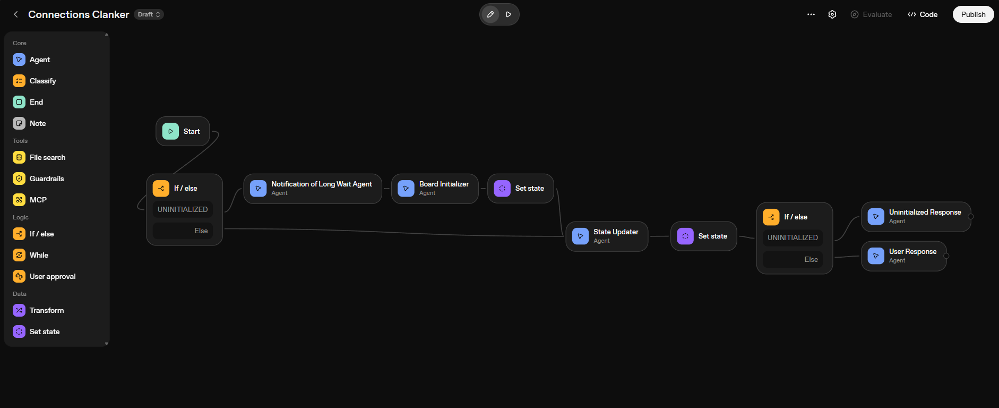

### Connections Clanker

A NYTimes Connections clone, in chatbot format. Basically, an excuse to take [ChatKit](https://developers.openai.com/api/docs/guides/chatkit/) and [Agent Builder](https://developers.openai.com/api/docs/guides/agent-builder/) for a spin and see how they work. Honestly, I don't really recommend, but it was fun anyway!

- If node-based canvas editors are your thing, [n8n](https://n8n.io/) is likely the better choice over the OpenAI Agent Builder
- ChatKit is fine I guess. You can get up and running quickly with a chat interface, but some things can be tough to customize and you're limited to OpenAI models. I would recommend the [Vercel Chatbot template](https://chatbot.ai-sdk.dev/) instead. Much more customizable and not iFrame-based.

---

